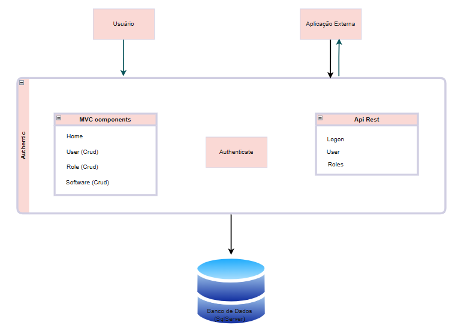
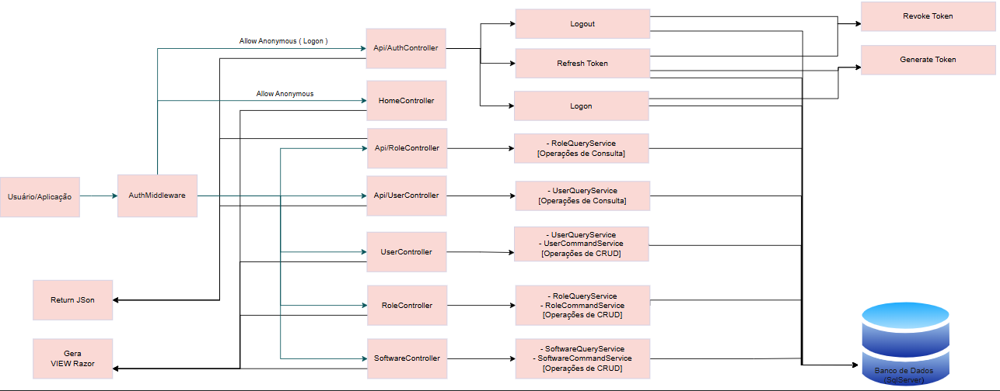

# Authentic
Este repositório contém o código-fonte de um **monolito híbrido** desenvolvido para gerenciar entidades de software, usuários e permissões. A aplicação atende tanto a requisições de usuários finais por meio de interface gráfica (MVC com Razor Views) quanto a sistemas terceiros e integrações através de uma API REST integrada.

## ⚙️ Desenho Técnico (Visão de Infraestrutura)

A aplicação centraliza sua regra de negócio em um único deploy, dividindo-se logicamente em dois contextos de exposição:

1. **MVC Components:** Camada responsável por renderizar as telas da aplicação web utilizando **Razor Views**. Utilizada diretamente pelos usuários finais.
2. **Api Rest:** Endpoints expostos que retornam dados estruturados em formato **JSON**. Utilizada para comunicação com **Aplicações Externas**.

Ambos os contextos compartilham a mesma camada de persistência e se comunicam diretamente com uma única instância do **Banco de Dados (SQL Server)**. A segurança e o isolamento de rotas privadas são garantidos centralizadamente por uma camada global de **Autenticação (Authenticate)**.

---

## 🔍 Desenho da Solução (Fluxo de Código)

O fluxo de dados da aplicação segue o padrão de controle de acesso gerenciado por um middleware de segurança de ponta a ponta.

### 1. Fluxo de Autenticação e Segurança
As requisições passam inicialmente pelo `AuthMiddleware`, que analisa o ciclo de vida da sessão e dos tokens de acesso:

*   **Allow Anonymous (Logon & Refresh Token):** Rotas públicas que desviam do middleware para permitir o acesso inicial ou a renovação de credenciais expiradas.
*   **Api/AuthController:** Controla o ciclo de vida da identidade digital por meio de três operações principais:
    *   `Logon`: Valida credenciais e interage com o componente **Generate Token** para criar o par de chaves de acesso.
    *   `Refresh Token`: Consulta diretamente o **SQL Server** para validar o tempo de vida e a integridade da chave de atualização. Se válida, emite um novo token.
    *   `Logout`: Interage com o componente **Revoke Token** para invalidar de forma segura o registro ativo diretamente na base de dados, garantindo o encerramento real da sessão.

### 2. Fluxo dos Controllers do Sistema
A aplicação gerencia quatro domínios principais, segregando rotas de API e de renderização de telas:

*   **HomeController:** Rota pública (`Allow Anonymous`) responsável pelo direcionamento inicial. É um componente puramente de navegação e **não possui acesso ao banco de dados**.
*   **SoftwareController / UserController / RoleController:** Controllers MVC tradicionais voltados para a experiência do usuário na plataforma.
    *   **Comunicação:** Direcionam o fluxo para suas respectivas camadas de serviço de leitura e escrita (`QueryService` e `CommandService`).
    *   **Retorno:** Processam e **Geram VIEW Razor**.
*   **Api/UserController / Api/RoleController:** Controllers de API REST voltados para integrações e consumo externo.
    *   **Comunicação:** No cenário atual, mapeiam as operações de leitura por meio do serviço especializado `QueryService` conectado ao banco.
    *   **Retorno:** Processam e realizam o **Return JSON**.

## 🛠️ Tecnologias Envolvidas
*   **Ambiente de Execução/Framework:** .NET (ASP.NET Core MVC / Web API)
*   **Renderização de Tela:** Razor Views (HTML/CSS integrado)
*   **Banco de Dados:** Microsoft SQL Server
*   **Mecanismo de Segurança:** JWT (JSON Web Tokens) com estratégia de Refresh Token persistido

## Desenho simples da arquitetura

## Desenho da solução

## Rodar Migrations e Seed (Package Manager Console)
  -  Update-Database
